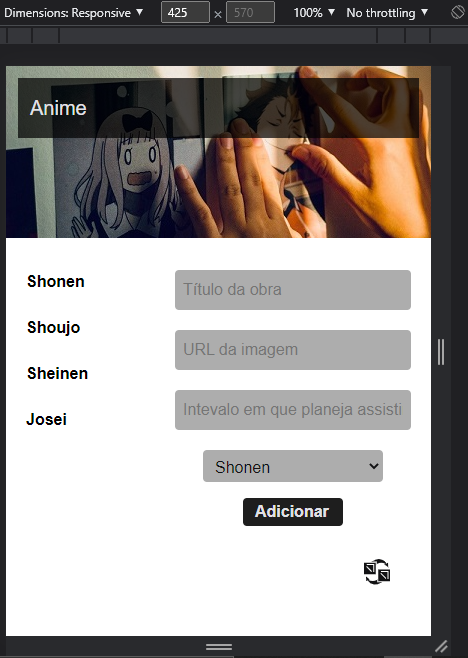
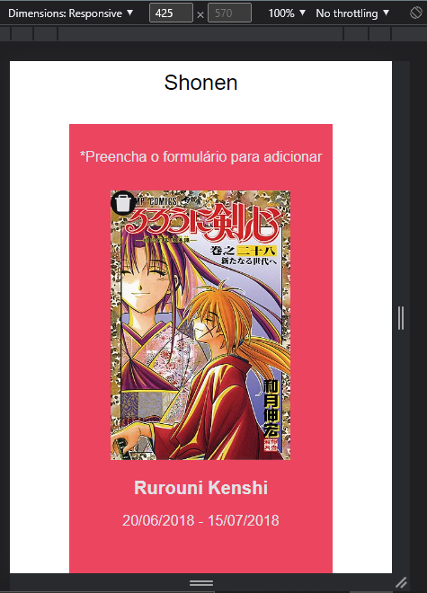

<h1 align="center"> Catálogo de animes </h1>

Projeto pessoal React.

  <a href="#-tecnologias">Tecnologias</a>&nbsp;&nbsp;&nbsp;|&nbsp;&nbsp;&nbsp;
  <a href="#-projeto">Projeto</a>&nbsp;&nbsp;&nbsp;|&nbsp;&nbsp;&nbsp;
  

 

  
  

## 🚀 Tecnologias

Esse projeto foi desenvolvido com as seguintes tecnologias:

- React
- JavaScript
- HTML, CSS

## 💻 Projeto

Projeto desevolvido para exercitar conseitos primários do React, como componentização e hooks, que ajuda o usuário a catalogar animes já assistidos onde poderá adicionar título da obra, período assistido e imagem em cards ordenados por categoria, dessa forma, poderá ser feita também a deleção de cada card. Foi pensado segundo os princípios do mobile first, mas adapta-se também a telas, maiores  
